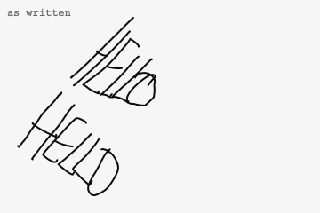
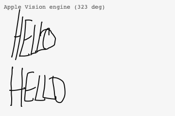
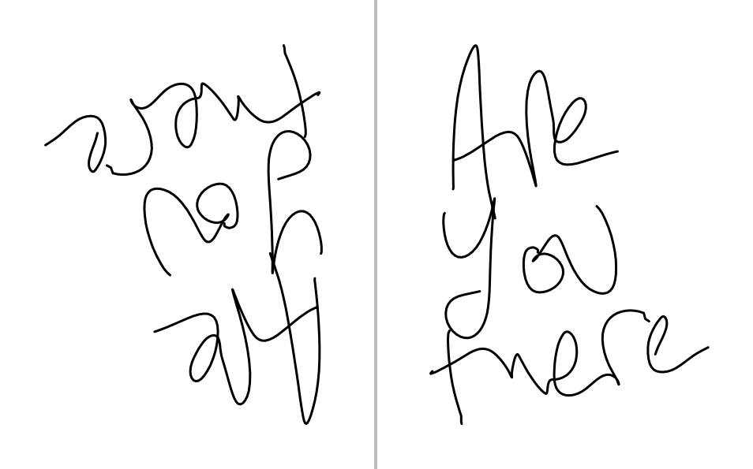
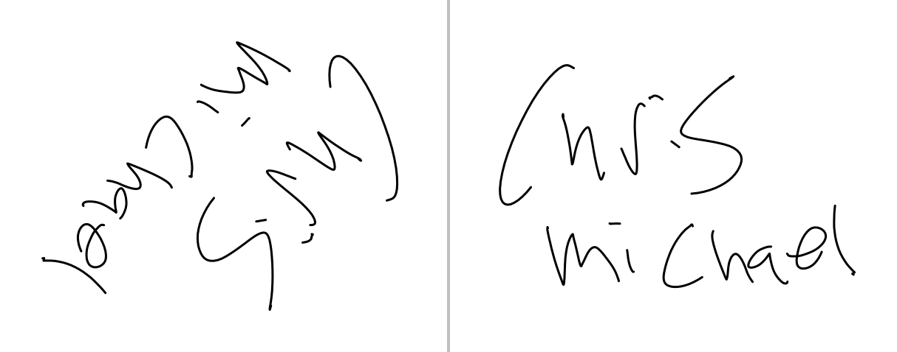
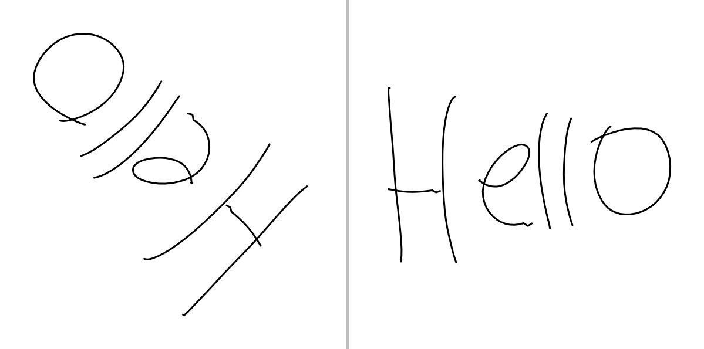
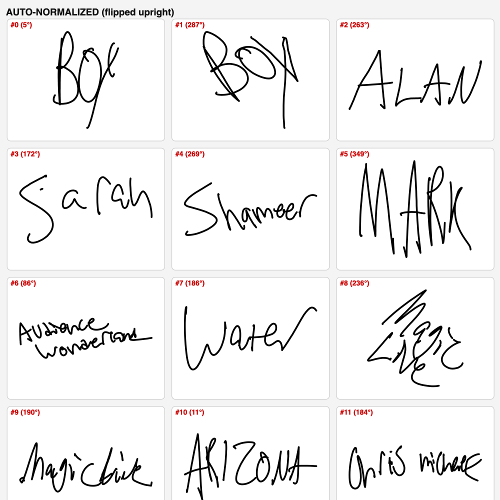
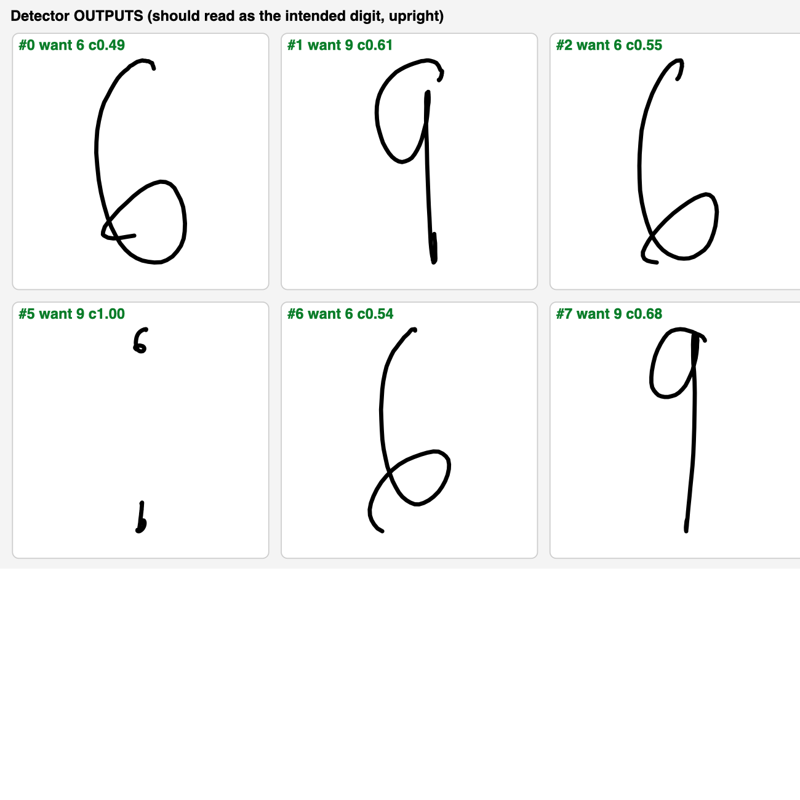

# Audience Wonderland Text Orientation

🎧 **Prefer to listen?** [Audio version of this README, read by me (9 min)](docs/readme-audio.m4a)

📊 **The headline result:** 99.5% correct orientation on real pad writing, tested across every angle (1,120 trials), and 98.5% on lone digits like a 6 vs a 9. Full breakdown in [The numbers](#the-numbers).

Detect the angle a person wrote at on an impression pad, and return the strokes rotated
upright, ready to feed a recognizer such as MyScript iink. It handles any angle, tall or
short letters, cursive, all caps, lone digits, and multiple lines, in a single geometric
pass. No recognition search.

This is v3. Everything in it earned its place on a benchmark, and I removed the parts of my
own earlier method that the benchmark proved were dead weight. The full story is below.

**Update 2026-07-23:** there is now a second engine, built on Apple's Vision framework,
aimed squarely at the close-two-line and cursive cases Shamir hit in testing. Jump to
[the Apple Vision engine](#new-the-apple-vision-engine-visiontextorientationswift).

## The problem I set out to solve

A spectator writes on the pad from wherever they are standing. The strokes arrive in
whatever direction they wrote, and the recognizer has no idea. This is not a corner the
recognizers forgot to handle: MyScript's own staff confirm the engine cannot infer
orientation, MLKit assumes upright ink, and Apple's Vision requires the caller to supply
the orientation. Somebody upstream has to rotate the ink upright first. That somebody is
this file, duh! Problem solved! 

The obvious fix is to run recognition in all four directions and keep the best answer.
That works, but every attempt costs a full recognition pass, and it can only ever snap to
four directions. You had that in the Lumen app, but not Impra. The reason is that it caused too much latency and gave recognition much too delayed.  I wanted the opposite: read the geometry of the strokes once, compute the exact angle, rotate once, recognize once, and do it super quickly so that performers never have to sweat :) .

## How I built it, start to finish

**Step 1: the core idea.** I take the center point of each stroke. The center of a tall
letter sits at its middle, on the text midline, so across a word the centroids line up
along the baseline no matter how tall or narrow the letters are. A PCA fit of those
centroids gives me the baseline angle at any angle, not just the four cardinals. That
leaves four possible readings of that axis (which end is up and which way do you read), so I
score all four for how much they read like text and keep the winner. Confidence is how much
the winner beat the runner-up. Low confidence means the geometry genuinely cannot tell, and
the system says "I don't know" instead of guessing and getting it wrong. This means the app can fall back to a recognition
retry. COOL! I verified this version on my own Lumen Trilogy: a rotation sweep at every 10
degrees came back 180 for 180 on my handwritten tests (and I have bad handwriting lol), worst case 2 degrees off, zero upside-down or sideways flips. 

**Step 2: check my method against the literature.** Before trusting it further, I ran a
deep prior-art sweep: published methods for handwriting orientation going back twenty
years (Nakagawa and Onuma's direction histograms, Leptonica's flip detector, Tesseract's
orientation voting, dynamic-programming line grouping, skew estimation, and more), with
every claim verified against its source. The sweep confirmed the architecture: geometric
pre-rotation feeding a single recognition pass is exactly the contract the recognizers
expect. It also handed me a shortlist of candidate upgrades. There was SOOO much. Spoiler: nothing does it as well as what I made, that's testable and you can verify that. 

**Step 3: measure everything.** I built a benchmark instead of arguing with myself. Every
sample gets rotated through all 36 ten-degree steps (meaning it gets tested every 10 degrees from zero to 360) plus 20 random angles that aren't increments of 10, and the detector
has to recover the rotation. The test data is 20 real impressions captured from my Trilogy
plus 600 samples from the DeepWriting handwriting dataset: 300 single words and 300 lone
characters, which is exactly the short, context-free unreliable type of input a spectator produces in the real world. Then I
implemented every candidate upgrade and let the numbers decide. I would charge some serious cash to do this, but hell, I love AWL! So I just hope this helps. Anyway...

**What is applied from the research I did:**

- **Pen-direction histogram** (after Nakagawa and Onuma). Pen-down strokes mostly travel
  down the glyph axis, and pen-up jumps (lifts) advance along the reading direction. So, there are two
  histograms, built once, that tell you which way is down even for a single glyph with no
  baseline at all. This is the single biggest upgrade in v3 of this software I made, and at heavy weight it powers
  the new lone-glyph (or single character) path.
  
- **Projection-profile sharpness.** At the correct rotation, ink collapses into tight
  horizontal bands; at the wrong one it smears. A capped histogram sharpness score captures
  that, and it is strongest exactly where the centroid baseline is weakest: short,
  square-aspect input. This is a great find! 
  
- **Smarter line clustering.** I replaced my fragile median-height line-gap rule with a
  robust character-size estimate (credit to Onuma) plus temporal breaks from long pen-up jumps. This
  alone took real-pad accuracy from 97.2% to 99.4%. So we are really cooking with heat. 
  
- **A new lone-glyph rule.** This was honestly the hardest part. For 1 or 2 strokes there is no baseline, damn.... BUT my v3 of this software blends glyph
  tallness, my start-is-up prior (people begin a 6 and a 9 at the top for instance), and the direction
  histogram, then fine-nudges the angle from the histogram's down peak. On lone digits this
  scores 98.5% versus 83.3% for my earlier rule. 

**What I found but threw away, in case you want to look into it:** 

a fine-skew regression stage (zero measured gain), Leptonica-style confidence gates (no better than a plain calibrated threshold), the DP line-grouping cost (weight tuned itself to zero, THIS WAS SO SLOW), an ascender-descender up-or-down count (flat), and reading pen tilt off the pad's Bluetooth protocol (the packets carry only x, y, and pressure, so there is nothing to read, no azimuth). 
I also removed my own line-stacking term from v2 after the testing showed it contributed nothing. It just worked without it anyway. If a term is in this file, it paid for itself on the benchmark; if it is not, I measured it, and it did not.

**Step 4: verify, then port.** I had an independent verification pass re-run the winning
configuration from scratch on fresh data and reproduced every number before I accepted it.
This Swift file was then checked against the reference implementation on 260 test cases,
matching to some really impressive precision. 

## The numbers

Four-way accuracy across the full rotation sweep, v3 versus my previous version:

| Test set | v2 | v3 |
|---|---|---|
| Real pad impressions (words, cursive, multi-line) | 97.2% | 99.5% |
| Single handwritten words (DeepWriting, 300) | 67.1% | 72.7% |
| Lone characters (DeepWriting, 300) | 43.4% | 53.4% |
| Lone digits | 83.3% | 98.5% |

Upside-down flips dropped on every set (lone characters: 22% down to 13%). Runtime is
about 0.6 ms per detection in pure Python on a laptop; this Swift version is faster. When
v3 is unsure it abstains rather than guessing, and abstained input goes to the retry
described below, so a wrong-but-confident answer is rare: on short words, decided output
flips 180 degrees only 1.2% of the time, versus 5.1% for v2.

## NEW: the Apple Vision engine (VisionTextOrientation.swift)

Shamir, this one is for the cases you showed me: two words written close together on two
lines (your John / Doe example), cursive, and diagonal writing. Those are exactly where my
geometric line clustering is weakest, so instead of patching it I added a second engine
that attacks the problem from the other side, and you can A/B them in the app.

**How it works.** It renders the strokes to an offscreen image and hands them to Apple's
on-device text recognizer (the Vision framework, nothing leaves the device). Here is the
part that surprised me, and I measured it rather than assumed it: Vision does NOT care
which way the text is rotated. It will read upside-down ink at full confidence, so the
obvious "try 4 rotations, keep the most confident" design does not work at all (I built it
first and it scored 15%, lol). What DOES work: Vision tells you WHERE the text it read
starts and ends. The box it returns around each read line is directed, its top-left corner
sits at the start of the text wherever that lands in the image. So one read gives you the
true reading direction as a continuous angle, upside down, diagonal, whatever. I probe a
few rotations anyway, cluster the answers, and let the heaviest cluster win so one garbage
read cannot hijack the result. Per-character boxes, in case you go looking: useless for
handwriting, Vision returns the whole-line box for every character. Measured that too.

**Why this fixes your two cases.** Vision segments the ink into lines ITSELF, and it is
very good at it. So two words crammed close together stop depending on my line clustering
entirely. And cursive is Vision's home turf, it was trained on far more handwriting than
any geometric rule will ever encode.

**The numbers** (same rotate-and-score harness as everything else in this README; the
two-line set is 30 trials built from real pad impressions stacked with a tight line gap,
including diagonal rotations like your photo):

| Test set | Geometric v3 | Vision engine | Hybrid |
|---|---|---|---|
| Close two-line, when it answers | 26/26 | 23/23 | 28/28 |
| Close two-line, abstains | 4 of 30 | 7 of 30 | 2 of 30 |
| Close two-line, median angle error | 8.8 deg | 3.7 deg | 3.7 deg |
| Full pad sweep (160 trials), decided accuracy | 100% | 84% | 88% |
| Runtime per call | under 1 ms | ~200 ms | 0 ms easy / ~200 ms hard |

Read that table honestly: the geometric engine is still king on speed and never decides
wrong on the pad set, but it abstains a lot on the hard cases. The Vision engine answers
the close-two-line and diagonal cases more precisely and more often. Its pad-sweep misses
are all on two impressions that are pure scribble, unreadable at ANY angle by a human, and
there Vision confidently picks a diagonal it likes. On scribble the "right" answer barely
means anything, but that is the trade: Vision can be confidently wrong on non-text ink
where geometry would abstain.

**So which do you ship?** `detectHybrid`. Geometry answers instantly when it is sure
(that was 99.5% of normal writing), and Vision referees only the cases geometry flags as
unsure, which are exactly your John / Doe and cursive cases. Worst case cost is one
~200 ms Vision pass on an impression that was about to be recognized wrong anyway.

```swift
// Somewhere off the main thread:
let result = VisionTextOrientation.detectHybrid(strokes)
if !result.abstain {
    let upright = TextOrientation.apply(strokes, rotation: result.radians)
    // -> MyScript / MLKit, same as before
}
// result.path tells you which engine decided: "text"/"glyph" = geometry (with
// "+refine" if the tilt pass adjusted it), "vision" = Vision.
```

Pure Vision, if you want to A/B it alone: `VisionTextOrientation.detect(strokes)`.
Options let you set probe angles, recognition level, languages, and abstain thresholds.
Both Swift files need to be in the target together. iOS 14+, no dependencies, offline.
This one is Apple-only though: for the Android build the geometric engine is still the
answer (it is pure math and ports anywhere).

Your John / Doe case, reconstructed on my real pad data (two close lines, written at a
diagonal), before and after the Vision engine:




### Tilt refinement and recognition readback (added same day, after live pad testing)

I then spent an afternoon writing on my own Stage with all of this running live, and the
testing exposed one more real weakness plus the fix for it. The quadrant was almost always
right, but on cursive and diagonal writing the geometric answer regularly landed 15 to 30
degrees tilted, and tilted ink is exactly where recognizers start dropping letters and
scrambling which line is first.

So `detectHybrid` now finishes with a **tilt refinement pass** (on by default, `refineTilt:
false` to disable): rotate by the coarse answer, hand the result to Vision ONCE, and
whatever small angle the read text still sits at gets subtracted out. It only trusts the
adjustment when Vision actually read something and agrees with the quadrant, so pure
scribble stays untouched instead of getting "corrected" into nonsense. Measured cost on my
machine: about 50 ms. The confidence floor for skipping Vision entirely also moved from
0.55 to 0.70 after a live case squeaked past the old floor at 0.56 and kept an 18 degree
tilt that Vision would have flattened.

There is also a new **`readback` API** so you can measure recognition quality instead of
guessing at it:

```swift
let before = VisionTextOrientation.readback(strokes)          // what OCR reads as written
let after  = VisionTextOrientation.readback(upright)          // what OCR reads after the fix
// .text (lines top to bottom), .confidence 0..1, .lineCount
```

Vision is not MyScript, but they trip over the same things, so this is an honest offline
proxy for "will recognition work". Two live results from my Stage that show why this
matters:

- "Hello" written at roughly 132 degrees, an angle nowhere near a 90 snap: OCR read `elo`
  as written, `HellO` at full confidence after the fix. Same ink, same recognizer, the
  only change was orientation.
- "Chris Michael" upside down on two close lines: as written, OCR read the lines in the
  WRONG ORDER ("michael" line first). After the fix it reads top to bottom correctly.
  If you have seen MyScript output words in a weird order on tilted multi-line input,
  this is probably why.

**Measured live speed** (my Stage, M-series Mac, seven consecutive impressions written at
arbitrary angles from 76 to 324 degrees, every one detected at confidence 1.00): the
geometric engine alone answered in 0.11 to 0.21 ms after the first warm-up call, and the
full hybrid including the Vision tilt-refine pass landed between 167 and 193 ms after pen
stop. iPhone hardware will be slower on the Vision pass, but the shape holds: the
orientation answer itself is effectively free, and the polish pass is well under a blink.

Live captures from that Stage session (left = as written, right = after the fix):





## Usage

```swift
let result = TextOrientation.detect(strokes)
// result.degrees, .confidence, .abstain, .lineCount, .path

let upright = TextOrientation.normalize(strokes)  // strokes rotated upright

// Feed MyScript. Nothing in your recognition pipeline changes:
let events = TextOrientation.myScriptPointerEvents(strokes)   // (x, y, t) pointer events
let text = myScript.recognize(events)

// Retry when the geometry says "don't know". Run the flipped candidate in
// parallel so even the fallback costs one pass of latency:
if result.abstain {
    let flipped = TextOrientation.apply(upright, rotation: .pi)
    // recognize `flipped` concurrently; keep the better result.
}
```

`Stroke` is `[StrokePoint]`; `StrokePoint` is `(x, y)`. Pressure and timestamps are not
required. Feed strokes in the order they were written; each pen-up ends a stroke. The
coordinate convention is y increasing downward, which is what the pads send.

**Picking the retry winner.** Neither MyScript's JIIX text export nor MLKit exposes numeric
confidence scores for text, so compare the two passes by candidate ranks and lexicon hits:
does one orientation's top answer appear in the other's candidate list, and is one a real
word when the other is junk.

**Free accuracy on the recognizer side.** While digging through the SDKs I found config
levers that cost nothing at runtime: in MyScript, enable `text.guides` and feed it the line
gap this detector already computes, and turn on per-character candidates in the JIIX
export (`text.words` and `text.chars`) so the retry has ranks to compare. In MLKit, pass a
`WritingArea` per line in the rotated frame and the previous line as `preContext`. None of
that is part of this file, but if you are integrating this, do those too.

## Honest limits IMPORTANT TO READ! I CAN HELP FIX THESE IF YOU ASK ME TO!

These limits are about the GEOMETRIC engine. The Vision engine above now covers the two
worst ones in practice (close lines and cursive) when you use `detectHybrid`. Additions
for the Vision engine itself: it costs ~200 ms when it fires, it is Apple-platform only,
and on ink that is not really text (pure scribble) it can confidently pick a wrong angle
where the geometry would have abstained.

- **Diagonal underlines.** I drop underlines and box edges before fitting, but the filter
  only catches them reliably when they arrive near-horizontal or near-vertical. A long
  underline at a diagonal still hurts accuracy. I tried the obvious rotation-invariant fix
  and the benchmark rejected it (it started eating legitimate strokes), so this stays an
  open item.
  
- **Lone letters** are the hardest input there is (53% four-way). Lone digits are strong,
  and multi-character input is unambiguous, but a single letter with no context is
  genuinely ambiguous even to a human reading rotated ink. The abstain flag and the retry
  carry this case.
  
- **Unusual stroke order.** The lone-glyph path leans on people starting glyphs near the
  top. Someone who draws a 6 bottom-up can still fool it; the direction histogram usually
  catches it now, but it is a strong aid, not a guarantee.

## Examples

Twelve varied words written at random orientations, all normalized upright:



Lone digits (6 and 9) at varied orientations, recovered upright:



## License

MIT. See [LICENSE](LICENSE).
