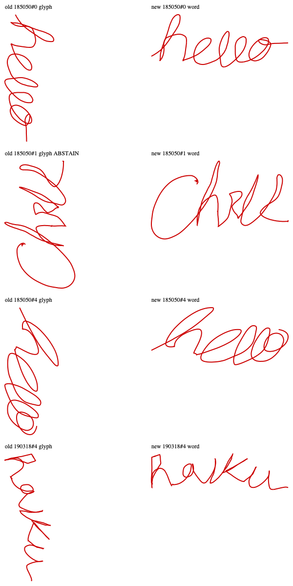

# Do people really make more downward strokes than upward ones?

My direction histogram leans on one assumption: while the pen is touching the pad, most
of the motion goes down. On 2026-10-05 I checked whether that is actually true, for
printed writing and for cursive. Short answer: yes for print, barely for cursive, and
digging into the cursive case is what turned up the sideways-cursive bug that the
joined-word path now fixes.

## What the published research says

- **Goodnow and Levine (1973), "The Grammar of Action," Cognitive Psychology 4.**
  Children and adults copying shapes follow consistent rules: start at the topmost,
  leftmost point, and draw vertical lines from top to bottom. This is the foundational
  source for "people write top to bottom."
- **Nakagawa and Onuma (IEICE 2005).** The paper my direction histogram comes from. A
  histogram of pen directions shows a strong peak along the downward axis, and they use
  it to find which way is up at about 96 to 99% accuracy. Their data was Japanese, where
  kanji are built mostly from downward and rightward strokes, so it does not prove the
  same thing for English on its own. That is why I measured it myself (below).
- **Simner's replication of stroke-order rules:** starting at the top and moving
  downward held in 85% of cases.
- **Handwriting instruction:** schools teach every letter to start at the top, partly
  because pulling a pen down is easier than pushing it up. Consistent with the rest,
  but not a measurement.
- Not supporting evidence, even though it comes up a lot: Meulenbroek and Thomassen
  (1991) is about which AXES people prefer to move along, not up vs down.

## What I measured

About 24,000 handwritten English words from the DeepWriting dataset (94 writers),
split by how connected the writing is. A word counts as cursive when 4 or more letters
were written in very few pen strokes, and as print when there is about one stroke per
letter. Reproduce it with [`tools/measure_stroke_direction.py`](../tools/measure_stroke_direction.py).

| Pen touching the surface | Print (22,152 words) | Cursive (2,315 words) |
|---|---|---|
| Vertical travel that goes down | 65.7% | 51.9% |
| Strokes that end lower than they start | 77.2% | 70.2% |
| Words with more down than up travel | 97.7% | 74.8% |
| Steep travel (60 degrees or more) that goes down | 69.2% | 56.9% |
| Typical slope, downstrokes vs upstrokes | 62 vs 45 degrees | 60 vs 45 degrees |

**Why cursive is nearly even:** in print, the pen lifts after a downstroke and travels
back up through the air, which is not counted. In cursive the pen stays down and climbs
back up on the connecting stroke into the next letter, so almost every downstroke gets a
matching upstroke. What survives in cursive: downstrokes are steeper than the
connectors, and whole strokes still mostly finish lower than they started.

## What it changed in the code

1. **I built a cursive test set and ran the detector on it: 21% correct.** The issue
   was not the histogram. A cursive word written in 1 or 2 strokes was going down the
   lone-glyph path (built for a single 6 or 9), and that path's "keep it tall" rule
   stood the whole word on its end. The fix is the joined-word path described in the
   README: cursive went to 75% (80% on held-out words it was never tuned on).
2. **The obvious idea from this research did NOT make it in.** Counting only steep
   strokes in the down vs up vote sounded right after seeing the table above, but on
   real pad writing it raised upside-down flips from 0.5% to 1.9%. Measured, rejected.

## Before and after, on my own Stage

These are the 4 impressions (out of 45 from my live Stage sessions) that the change
affected. Left is the old answer, right is the new one. All 4 were sideways before and
upright now; the other 41 came out identical.

## Sources

- [Goodnow and Levine 1973, as summarized in later work](https://www.sciencedirect.com/science/article/abs/pii/0001691889900255)
- [Nakagawa and Onuma, IEICE 2005](https://globals.ieice.org/en_transactions/information/10.1093/ietisy/e88-d.8.1823/_p)
- [Meulenbroek and Thomassen 1991](https://www.socsci.ru.nl/meulenbroek/Publications/Meulenbroek%20and%20Thomassen%201991.pdf)
- [Up vs down strokes in writing slant](https://www.sciencedirect.com/science/article/abs/pii/0001691883900288)
- [DeepWriting dataset](https://files.ait.ethz.ch/projects/deepwriting/deepwriting_dataset.zip) (research/eval license; not included in this repo)
